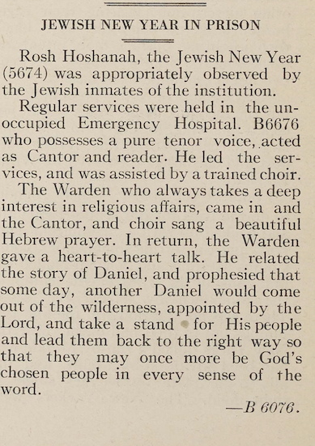

<!DOCTYPE html>
<html lang="en">
<head>
    <meta charset="UTF-8">
    <meta name="viewport" content="width=device-width, initial-scale=1.0">
    <title>Personal Life</title>
    
</head>
<body>
    

        <h2>Personal Life</h2>
        

            

                
                

                    This is an image of the incarceration record of Harry Haspel.
                

            

            

                Harry Haspel was a white male born September 13th, 1886. He was a native of Romania with Austrian ancestry. It appears that he carried his heritage and Jewish religion with him as he navigated life in America. Harry settled down with his wife, Rose Haspel, and their one child. At the age of 26, he had both his mother and father still living, which instilled his strong and traditional family identity. This identity would end up shaping his future contributions to his community, specifically his religious values and rituals.
            

        

    

</body>
</html>

<html lang="en">
<head>
    <meta charset="UTF-8">
    <meta name="viewport" content="width=device-width, initial-scale=1.0">
    <title>Learning and Leadership</title>
    
</head>
<body>
    

        <h2>Learning and Leadership</h2>
        

            

                
                

                    This is an image of the article in the Newspaper: The Umpire, that mentions Harry Haspel
                

            

            

            Harry had an educational background of about 4 years in public school, where he learned reading and writing. Harry’s life took an unexpected turn when he was incarcerated at Eastern State Penitentiary in 1913. Despite the isolating and harsh conditions of a prison, he drew on his background to provide religious leadership to the community he shared with fellow prisoners. On the Jewish High Holidays, specifically Rosh Hashanah, the Jewish New Year, he acted as the Cantor and led his community in Hebrew prayer and song. Although he was accompanied by a choir, he ultimately was the one leading his congregation in beautiful melodies. His background allowed him to share his wisdom and comprehension of religious texts with his Jewish community during services, enhancing their understanding and connection to Judaism.
            

        

        

        In Judaism, the cantor plays a crucial role alongside the rabbi, guiding the congregation spiritually through music. The rabbi teaches and interprets Jewish law and customs from the Torah, while the cantor guides worship through song. During services, the cantor will chant and sing prayers, which typically include Hebrew verses and melodies that have been passed down through generations. Together, the rabbi and cantor create a unified worship experience that strengthens the congregation’s ties to their faith and heritage.
        

        

       In the prison community, where Harry was incarcerated, the Jewish population was only a small fraction, making his role as cantor even more significant. On Rosh Hashanah, one of the holiest days in the Jewish Calendar, Harry’s leadership in Hebrew reading and song was especially meaningful. His guidance helped to create a sense of belonging for a minority community during such a sacred time. He played a major role in creating a spiritual refuge, offering his community a safe space to deeply connect with God and one another as they began the new year.
        

    

</body>
</html>

<!DOCTYPE html>
<html lang="en">
<head>
    <meta charset="UTF-8">
    <meta name="viewport" content="width=device-width, initial-scale=1.0">
    <title>Legacy and Tradition</title>
    
</head>
<body>
    

        <h2>Legacy and Tradition</h2>
        

            

                
                

                    This is a photo taken from Eastern State Penitentiary in October of 2024. It is a display of the synagogue in 1959, which was built in 1924.
                

            

            

                Even in challenging times, the Jewish community found a place of sanctuary and enduring connection. Harry’s leadership and participation in Jewish practices, specifically on the high holidays, contributed to a larger legacy of Judaism within his community. His efforts helped to preserve tradition that would continue beyond his time.
            

        

        

            The image of the Jewish congregation gathered under the Torah ark, taken in 1959 and still displayed in 2024, serves as a powerful reminder of the devotion and faith upheld by individuals like Harry. The foundations laid down by leaders like Harry in the 1920's continue to inspire later generations, illustrating the lasting impact of their values and rituals. The efforts of leaders in faith ensured that these traditions would last long after their time, allowing future generations to maintain a strong religious identity. Harry’s legacy goes even further to exemplify the resilience of Jewish culture, with the synagogue on display symbolizing that the community’s traditions continue to provide meaning in modern times.
        

    

</body>
</html>

